# 5. Data Preparation process

Data compliance with different tier levels can be performed progressively. For all three tiers, the process starts with the extraction and annotation (optional) of data, and is followed by various steps of de-identification and re-identification risk assessment, quality check and standardization. The details of the steps will be provided in the following sections, but the outline is the following:

| Requirement for       | Dataset remains on premises                                                                                                                                                                                                                                                                                                                                                                                                                                                                                                                                                                                               | Dataset is exported to a reference node                                                                                                                                                                                                                                                                                                                                                                                                                                                                                                                                                                                                                                                                                                                                                                      |
| --------------------- | ------------------------------------------------------------------------------------------------------------------------------------------------------------------------------------------------------------------------------------------------------------------------------------------------------------------------------------------------------------------------------------------------------------------------------------------------------------------------------------------------------------------------------------------------------------------------------------------------------------------------- | ------------------------------------------------------------------------------------------------------------------------------------------------------------------------------------------------------------------------------------------------------------------------------------------------------------------------------------------------------------------------------------------------------------------------------------------------------------------------------------------------------------------------------------------------------------------------------------------------------------------------------------------------------------------------------------------------------------------------------------------------------------------------------------------------------------ |
| **Tier 1 compliance** | <ul><li>Dataset must be registered in the public catalogue.</li><li>Image and clinical data must be linked using a single, consistent patient identifier (patientID), preserved across all preparation steps.</li><li>No entity (e.g. patient, observation, study, series) may be duplicated within the dataset.</li></ul>                                                                                                                                                                                                                                                                                                | <ul><li>Dataset must be registered in the public catalogue.</li><li>Image and clinical data must be linked using a single, consistent patient identifier (patientID), preserved across all preparation steps.</li><li>No entity (e.g. patient, observation, study, series) may be duplicated within the dataset.</li><li>De-identification and quality check is required prior to transfer.</li><li>Imaging data must be accompanied by a set of minimum clinical metadata. Only-imaging datasets, with imaging attributes only, will be considered case-by-case before acceptance in the platform.</li><li>To transfer the data to a reference node, format for images should be preferably DICOM objects. NIfTI could be also handled by both reference nodes (add link to instructions as ref).</li></ul> |
| **Tier 2 compliance** | <ul><li>Compliance with Tier 1 requirements</li><li>The metadata required for the federated search must be standardized and semantically aligned with the EUCAIM hyper-ontology.</li><li>Compliance with the EUCAIM Common Data Model (CDM) is <strong>recommended but not mandatory</strong>. If the data is not transformed to the EUCAIM CDM, you must instead implement a mapping component that translates local data to the searchable variables required by the federated search.</li><li>A query service component should be installed to run the search.</li></ul>                                               | <ul><li>Compliance with Tier 1 requirements</li><li>The metadata required for the federated search must be standardized and semantically aligned with the EUCAIM hyper-ontology.</li><li>Compliance with the EUCAIM Common Data Model (CDM) is <strong>recommended but not mandatory</strong>. If the data is not transformed to the EUCAIM CDM, you must instead implement a mapping component that translates local data to the searchable variables required by the federated search.</li></ul>                                                                                                                                                                                                                                                                                                           |
| **Tier 3 compliance** | <ul><li>Compliance with Tier 1 and Tier 2 requirements</li><li>Provide imaging data in DICOM format; associated annotations and segmentations, when available, must be in DICOM-SEG format. Exceptions may be considered for diagnostic images in other formats, on a case-by-case basis.</li><li>Full compliance with the EUCAIM Common Data Model (CDM) is required.</li><li>Organize imaging and clinical data following the EUCAIM common file structure.</li><li>Materialize imaging and clinical metadata according to the EUCAIM CDM.</li><li>Data should be integrated into the materializer component.</li></ul> | <ul><li>Compliance with Tier 1 and Tier 2 requirements</li><li>Provide imaging data in DICOM format; associated annotations and segmentations, when available, must be in DICOM-SEG format. Exceptions may be considered for diagnostic images in other formats, on a case-by-case basis.</li><li>Full compliance with the EUCAIM Common Data Model (CDM) is required.</li><li>Organize imaging and clinical data following the EUCAIM common file structure.</li><li>Materialize imaging and clinical metadata according to the EUCAIM CDM.</li><li>Data should be integrated into the materializer component.</li></ul>                                                                                                                                                                                    |

## **Minimum metadata requirements for the imaging and clinical data:**

### Minimum imaging attributes (from DICOM metadata)

| Variable                             | Explanation            | Classification | Example  |
| ------------------------------------ | ---------------------- | -------------- | -------- |
| Patient ID                           | DICOM tag: (0010,0020) | Mandatory      | X123456  |
| Image modality                       | DICOM tag: (0008,0060) | Mandatory      | CT       |
| Image body part                      | DICOM tag: (0018,0015) | Mandatory      | Chest    |
| Image manufacturer                   | DICOM tag: (0008,0070) | Mandatory      | Siemens  |
| Date of image acquisition (YYYYMMDD) | DICOM tag: (0008,0022) | Mandatory      | 20240101 |

_If images are in NIfTI format, these metadata must be supplied in DICOM JSON format._

The patient's age at the time of each imaging study must be provided either:

* directly in the **PatientAge DICOM tag (0010,1010)**, or
* indirectly by calculating it using **Age at diagnosis** and **Date of image acquisition**.

***

### Minimum clinical attributes – positive or diagnostic cases

| Variable                                        | Explanation                                                 | Classification         | Example                 |
| ----------------------------------------------- | ----------------------------------------------------------- | ---------------------- | ----------------------- |
| Patient ID                                      | Unique identifier matching the DICOM Patient ID (0010,0020) | Mandatory              | X123456                 |
| Population                                      | Categorization of subjects based on status                  | Mandatory              | Patient with Cancer     |
| Sex                                             | Biological sex at birth                                     | Mandatory              | Female                  |
| Date of radiology detection                     | Date when lesion/tumor first detected by imaging            | Mandatory if available | 2024-01-01              |
| Date of pathology confirmation / diagnosis date | Date when tumor is histologically confirmed                 | Mandatory if available | 2024-02-01              |
| Age at diagnosis (years, one decimal)           | Age when tumor or lesion was confirmed                      | Mandatory              | 45.5                    |
| Pathology confirmation                          | Method used to confirm pathology                            | Mandatory if available | Biopsy                  |
| Topography                                      | Location of lesion (organ, region, laterality)              | Organ mandatory        | Lung                    |
| Pathology                                       | Histology and subtype (ICDO-3 if available)                 | Mandatory if available | Adenocarcinoma          |
| Imaging procedure protocol                      | Protocol used to acquire diagnostic image                   | Mandatory if available | CT thorax with contrast |
| Treatment                                       | Type of treatment received                                  | Mandatory if available | Chemotherapy + surgery  |
| Date of first treatment                         | Date when treatment started                                 | Mandatory if available | 2024-03-01              |

**Important:**\
If dates are not available or have been modified due to anonymisation, **relative days from a baseline timepoint must be provided**.

***

### Minimum clinical attributes – negative screening or control groups

| Variable                    | Explanation                                      | Classification         | Example            |
| --------------------------- | ------------------------------------------------ | ---------------------- | ------------------ |
| Patient ID                  | Identifier matching DICOM Patient ID (0010,0020) | Mandatory              | X123456            |
| Population                  | Screening or control group status                | Mandatory              | Screening negative |
| Sex                         | Biological sex at birth                          | Mandatory              | Female             |
| Date of imaging acquisition | Date of screening/control imaging                | Mandatory if available | 2024-01-01         |
| Age (years, one decimal)    | Age when imaging study was acquired              | Mandatory              | 45.5               |
| Topography                  | Area examined with imaging modality              | Mandatory              | Lung               |

For negative screening/control groups, **region and laterality are not mandatory**.

***

### Minimum annotation metadata

| Name                              | Description                      | Level             | DICOM Tag   | Requirement                              | Example                         |
| --------------------------------- | -------------------------------- | ----------------- | ----------- | ---------------------------------------- | ------------------------------- |
| Segment number                    | Unique identifier of the segment | Imaging           | (0062,0004) | Mandatory                                | 1                               |
| Segment label                     | Label identifying the segment    | Imaging / Dataset | (0062,0005) | Mandatory                                | Prostate peripheral zone        |
| Segment description               | Ontology or user description     | Imaging / Dataset | (0062,0006) | Mandatory                                | Prostate Central Zone           |
| Segmentation method               | Algorithm type used              | Imaging / Dataset | (0062,0008) | Mandatory                                | Manual                          |
| Algorithm name                    | Algorithm name and version       | Imaging / Dataset | (0062,0009) | Mandatory if algorithm is semi-automatic | Prostate segmentation tool v1.0 |
| Number of annotators              | Number of experts involved       | Dataset           | –           | Mandatory                                | 2                               |
| Annotator type                    | Role of annotators               | Dataset           | –           | Mandatory                                | Radiologist                     |
| Experience                        | Years of experience              | Dataset           | –           | Mandatory                                | 10                              |
| Sequence(s) used for segmentation | Imaging modality used            | Dataset           | –           | Mandatory                                | T2w                             |

_Values should preferably be provided at the imaging level using DICOM tags. If identical for all studies, they may be provided once at dataset level._

## 5.1. Data preparation and related tools from the EUCAIM catalogue

For the purpose of data preparation, several tools have been selected and developed in EUCAIM. [Figure 7](DataPreparation.md#fig_datatools) shows the main tools selected for this phase.

_**Use of EUCAIM-provided tools**_

Note that the use of EUCAIM tools is not mandatory to complete all the steps described below; however, their use is strongly recommended. Users may choose to employ their own tools if they are more comfortable with them. The data preparation processes might slightly require different tools depending on their specific requirements and intended tier level. Please read the sections below carefully. EUCAIM technical support team can assist you throughout this process via the [Helpdesk](https://help.cancerimage.eu/).

### &#x20;

|                                                                                                                                                                                                                              |                                                                                                                                                                                                                                 |
| ---------------------------------------------------------------------------------------------------------------------------------------------------------------------------------------------------------------------------- | ------------------------------------------------------------------------------------------------------------------------------------------------------------------------------------------------------------------------------- |
| 
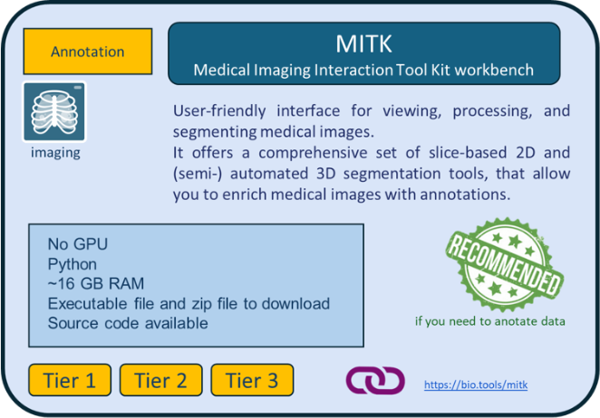 <a href="https://bio.tools/mitk">https://bio.tools/mitk</a>
                                                                                                        | 
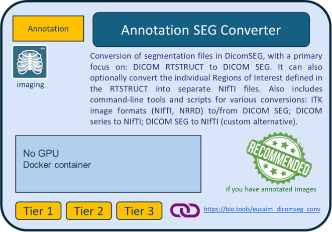 <a href="https://bio.tools/dicomseg_converter">https://bio.tools/dicomseg_converter</a>
                                                    |
| 
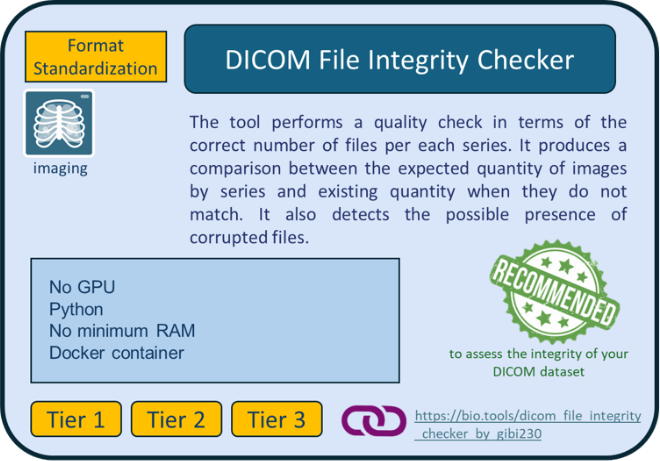 <a href="https://bio.tools/dicom_file_integrity_checker_by_gibi230">https://bio.tools/dicom_file_integrity_checker_by_gibi230</a>
 | 
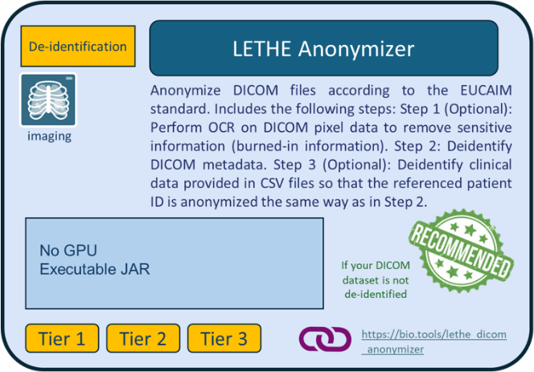 <a href="https://bio.tools/lethe_dicom_anonymizer">https://bio.tools/lethe_dicom_anonymizer</a>
                                                          |
| 
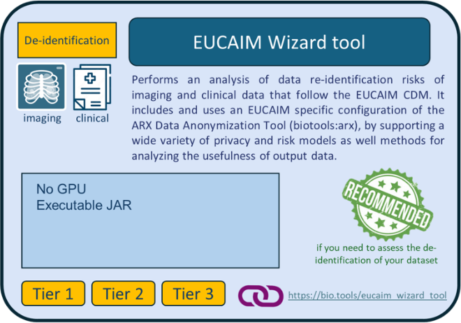 <a href="https://bio.tools/eucaim_wizard_tool">https://bio.tools/eucaim_wizard_tool</a>
                                                            | 
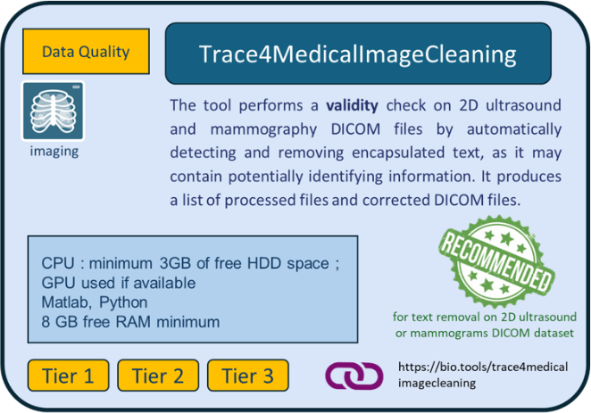 <a href="https://bio.tools/trace4medicalimagecleaning">https://bio.tools/trace4medicalimagecleaning</a>
                                    |
| 
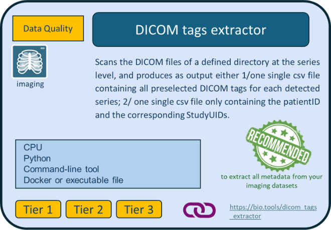 <a href="https://bio.tools/dicom_tags_extractor">https://bio.tools/dicom_tags_extractor</a>
                                                 | 
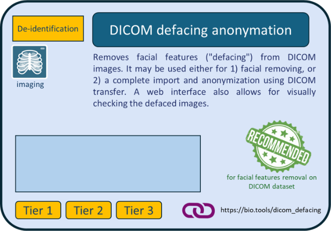 <a href="https://bio.tools/dicom_defacing_anonymation">https://bio.tools/dicom_defacing_anonymation</a>
                                       |
| 
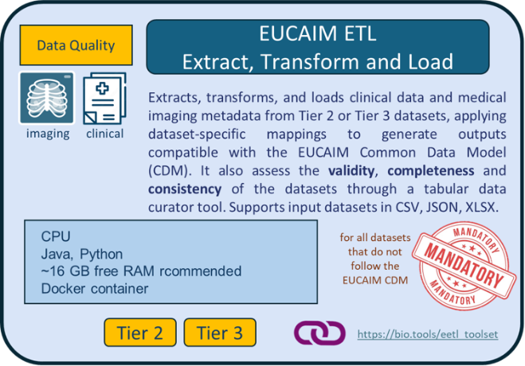 <a href="https://bio.tools/eetl_toolset">https://bio.tools/eetl_toolset</a>
                                                                                   | 
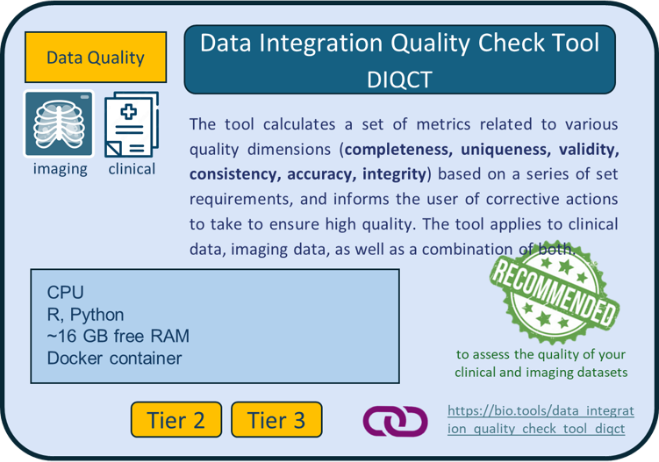 <a href="https://bio.tools/data_integration_quality_check_tool_diqct">https://bio.tools/data_integration_quality_check_tool_diqct</a>
 |
| 
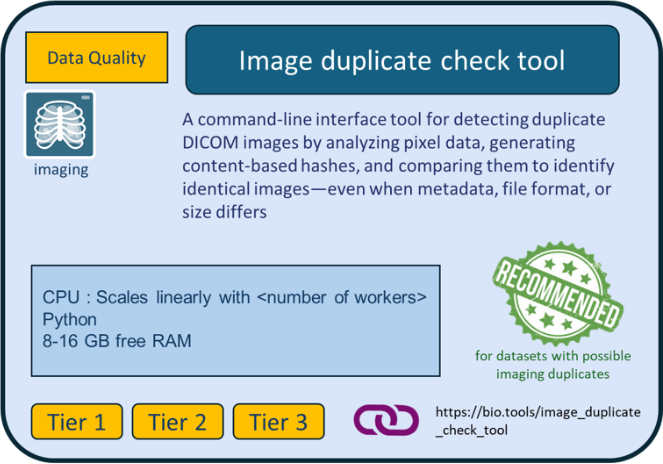 <a href="https://bio.tools/image_duplicate_check_tool">https://bio.tools/image_duplicate_check_tool</a>
                         | 
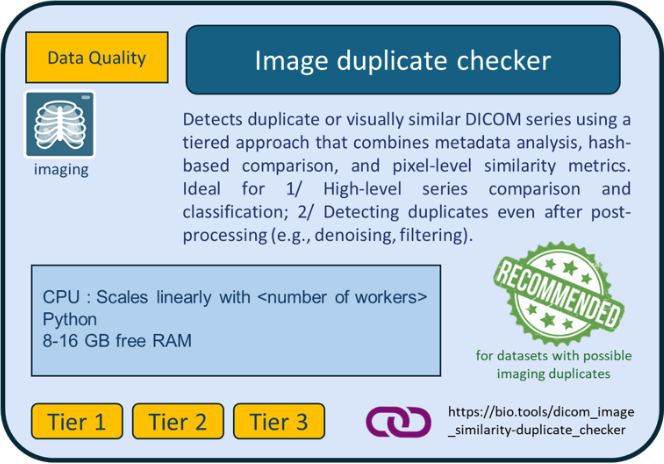 <a href="https://bio.tools/dicom_image_similarity-duplicate_checker">https://bio.tools/dicom_image_similarity-duplicate_checker</a>
         |

[Figure 7](DataPreparation.md#fig_datatools): EUCAIM data preparation tools for data holders.

Instructions on the downloading and usage of each tool are given in the links provided in the description of the tools in the bio.tools catalogue.

Data holders can get information about the data preparation tools (listed in the following subsections) in the bio tools catalogue ([https://bio.tools/t?domain=eucaim](https://bio.tools/t?domain=eucaim)). The binaries of the tools can be downloaded from:

* the EUCAIM Software artifacts registry (the EUCAIM harbor), usually for container images
* the EUCAIM drive repository, usually for non-containerized tools

The access to both (artifacts registry and drive) requires a valid account and additional permissions that can be requested on the first access (only data holders and project members can download the tools).

#### Access to the EUCAIM Software artifacts registry (Harbor)

([https://harbor.eucaim.cancerimage.eu/harbor/projects/3/repositories](https://harbor.eucaim.cancerimage.eu/harbor/projects/3/repositories))

Instructions on how to request access and download tools are available [here](https://drive.eucaim.cancerimage.eu/s/pxpTJWSTFsLbqPQ?dir=/\&editing=false\&openfile=true)

#### Access to the EUCAIM drive repository

([https://drive.eucaim.cancerimage.eu/apps/files/files/1520?dir=/Applications](https://drive.eucaim.cancerimage.eu/apps/files/files/1520?dir=/Applications))

## 5.2. Tier 1 datasets

### **Steps to prepare your Tier 1 dataset for transfer to a reference node**

The preparation of your dataset will follow four steps: image annotation (optional), de-identification, data quality check, and data transfer. They are described below.

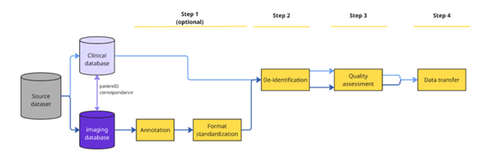

#### **Step 1: Image annotation (optional)**

You may want to annotate your imaging data to enrich the quality of your dataset.

**Tools:** We recommend using the [**MITK (Medical Imaging Interaction Toolkit) Workbench**](https://bio.tools/mitk), which ensures the output format will be in the required format to be compliant with EUCAIM. Using it would avoid the burden (and the risk) of additional conversion procedures. Data can be also annotated using the DICOM Viewers from reference node environments after transferring the data.

**Format standardization (optional)**: it is recommended that your imaging raw data are in DICOM format, and that your annotations are in DICOM-SEG.

**Tools:** If you have existing annotation files that are not in DICOM-SEG, you may use the EUCAIM [**Annotation Seg converter**](https://bio.tools/dicomseg_converter) tool to convert them.

#### **Step 2: De-identification**

You must ensure that no identifiable information (direct or indirect) is present in the dataset you will share.

_**Important points to consider before de-identification**_

If your Tier 1 dataset is not originally anonymized we recommend preparing a tabular file associating StudyUIDs from DICOM images with corresponding clinical “episode” and “timepoint events”, in case the dataset contains multiple episode/timepoints.

**Tools:** This can be done using the [**DICOM tags extractor**](https://bio.tools/dicom_tags_extractor) tool ([Figure 7](DataPreparation.md#fig_datatools)). For more information, see further below section [Step 2](DataPreparation.md#step-2-imaging-correspondence-with-clinical-data) on imaging data preparation.

If your imaging data are not already de-identified, you may use the [**Lethe EUCAIM Anonymizer**](https://harbor.eucaim.cancerimage.eu/harbor/projects/3/repositories/lethe-dicom-anonymizer/) ([Figure 7](DataPreparation.md#fig_datatools)). In this case, you must ensure the following:

* the patient ID linking clinical and imaging data must be identical and listed as the first variable in the clinical dataset for tabular data;
* your raw imaging data are in DICOM format;
* the tool requires as input the SITE ID, the unique identifier of the data provider, which you can see in your user profile from the [EUCAIM Dashboard](https://dashboard.eucaim.cancerimage.eu/) ([Figure 9](DataPreparation.md#fig_dataanon)). In case your Life Science account is not assigned to a known organization, then this will be empty and so you can create a [Helpdesk](https://help.cancerimage.eu/) ticket in the group of “Dashboard” to request one.

Special attention must be given to **embedded text** in images, which may contain patient-identifiable information, as well as **craniofacial images** that pose a risk of patient re-identification. You may need to apply additional de-identification techniques to mitigate this risk.

**Tools:** the [**DICOM defacing anonymisation**](https://bio.tools/dicom_defacing_anonymation) tool from the EUCAIM catalogue ([Figure 7](DataPreparation.md#fig_datatools)) may be used to remove facial features from your DICOM images. [The Lethe EUCAIM Anonymizer](https://harbor.eucaim.cancerimage.eu/harbor/projects/3/repositories/lethe-dicom-anonymizer) tool also provides options to remove burned-in PHI pixel data from the images.

**Re-identification risk assessment (optional)**: Even if no automatic re-identification risk analysis on a combination of clinical and imaging metadata is possible at this Tier, you should carefully assess that no direct or indirect identifiers are present in your data.

**Tools:** For assessing the risk of re-identification of patients based on your **imaging metadata** before sharing your dataset, you may use the [EUCAIM **Wizard tool**](https://bio.tools/eucaim_wizard_tool). Extraction of imaging metadata to feed the wizard tool is possible by using the [**DICOM tags extractor**](https://bio.tools/dicom_tags_extractor) tool ([Figure 7](DataPreparation.md#fig_datatools)). You may also use the [ARX Anonymization Tool](https://bio.tools/arx) to assess the re-identification risk of your clinical metadata, but it requires the specification of the quasi-identifier attributes by the DH. In addition, the creation of generalization hierarchies is necessary if you want to perform a utility–risk trade-off analysis and apply appropriate risk-mitigation strategies.

### &#x20;

<figure>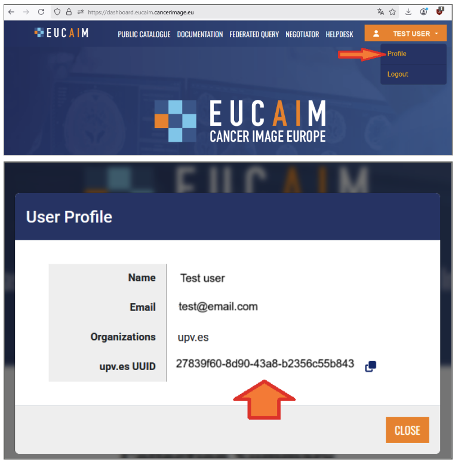<figcaption>
Figure 9. Retrieving SITE ID from the Dashboard.
</figcaption></figure>

#### **Step 3: Data quality check**

**As per the EUCAIM data quality framework, you must ensure that your dataset is**:

* **Complete**: all required data values are present.
* **Unique**: no entity exists more than once within the dataset.
* **Consistent**: values across attributes, records, files and timepoints, comply with predefined logical and temporal rules.
* **Accurate**: correspondence between dataset values to real values.
* **Showing integrity**: absence of data value loss or corruption.

You may use dedicated tools to assess the degree of compliance of your dataset to these principles.

**Tools:** Some tools from the EUCAIM catalogue can help you to assess the degree of compliance of your dataset to each EUCAIM DQ dimension:

* the **accuracy** and **integrity** of your imaging dataset may be assessed using the [**DICOM File integrity checker**](https://bio.tools/dicom_file_integrity_checker_by_gibi230).
* **Uniqueness** can be addressed with two EUCAIM tools that search for image duplicates: the [**Image duplicates checker**](https://bio.tools/dicom_image_similarity-duplicate_checker), capable of detecting duplicate or visually similar DICOM series by combining metadata analysis, hash-based comparison, and pixel-level similarity metrics; the [**Image duplicate check tool**](https://bio.tools/image_duplicate_check_tool), that detects duplicate DICOM images by analyzing pixel data.

#### **Step 4: Data transfer**

Tier 1 datasets can either be transferred to a reference node, or remain at your site. If your dataset remains on site, any data users interested in your dataset (as per the information found in the EUCAIM catalogue) will be put in direct contact with you. If you wish to transfer your dataset to a reference node, please refer to Section 6 of the Handbook for further information.

## 5.3. Tiers 2 & 3 datasets

### **EUCAIM Common Data Model and Hyperontology**

The [**EUCAIM Common Data Model**](https://eucaim.gitbook.io/eucaim-common-data-model/1.-introduction) defines a standardized structure for representing clinical and imaging metadata across the EUCAIM platform. It ensures that data contributed by different partners can be understood and used in a consistent way.

**Key features:**

* It is based on the conceptual model of [mCode specification](https://ascopubs.org/doi/10.1200/CCI.20.00059)
* The current version of the EUCAIM CDM Data Dictionary is available [here](https://docs.google.com/spreadsheets/d/1ox9PdvfCDxpDmEnFzC1M6OFhUhXpjQzg/edit?usp=sharing\&ouid=115998150174651530097\&rtpof=true\&sd=true).
* Supports multimodal data (i.e. imaging and clinical).
* Facilitates efficient querying, tool compatibility, and federated analysis and learning.

The [**EUCAIM hyperontology**](https://hyperontology.eucaim.cancerimage.eu/) is a common semantic meta-model that supports and maintains semantic interoperability and ensures consistent mapping and harmonization with the EUCAIM CDM entities (tables and attributes). It provides rich context, making it easier for users and tools to interpret, search, and reason over the data. In addition, the EUCAIM Hyperontology connects the CDM’s data fields to standardized biomedical concepts (i.e. terminology-binding) to verify that the data elements represented in the EUCAIM CDM are semantically aligned with the knowledge (concepts and object/data properties) described in the hyper-ontology. This ensures a coherent interpretation and understanding of data between the hyper-ontology and CDM.

**Why it is important:**

As a data holder, understanding the CDM and hyperontology is essential for:

* **Mapping your data correctly**: Ensuring your local dataset aligns with EUCAIM standards.
* **Using tools effectively**: Tools in the EUCAIM ecosystem rely on the CDM to operate correctly.
* **Supporting reproducibility and scalability**: Harmonized data makes it easier to run federated analysis and integrate new tools.

### **Steps to prepare your Tier 2 or Tier 3 dataset to follow the EUCAIM CDM**

The preparation of your dataset will follow 7 steps: clinical data structuring, imaging correspondence with clinical data, image annotation (optional), de-identification, data quality assessment, data conversion to EUCAIM Common Data Model, and Data transfer (optional). They are described below.

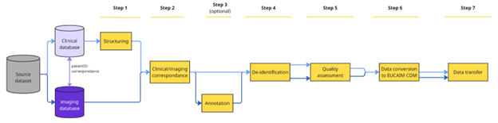

#### **Step 1: Clinical data structuring**

In order to have interoperable data that can be queried and processed, we need you to provide us with information on your dataset structure using another tabular template file ([EUCAIM\_example\_file\_patients\_datasets\_CDM\_v7](https://docs.google.com/spreadsheets/d/1ZYm9g7xCvRE65taMP-kvB57VbT16x9n3/edit?gid=1589152533#gid=1589152533)) _in addition to_ your source dataset.

**How the tabular template file is organized:**

* The “Data elements” tab lists the entities and their corresponding data elements for clinical variables, with definition and data type;
* The other 3 tabs show an example of how to structure your datasets of positive or diagnostic cases (for negative screening and control groups, please refer to the corresponding template file);
  * the “Overarching Episode” corresponds to the entire course of the patient’s data collection (example: from diagnosis to death or last contact). All diagnosis information should be in there;
  * each episode recorded in your dataset must be separated from the first tab in another tab in chronological order (example : “Treatment 1”, “Progression”, “Treatment 2”, “Remission”, “Relapse”, “Treatment 3”, “Active Surveillance”).

In each tab :

* On line 1 contains the names of the variables as they are defined in your own dataset
* On line 2 are the name of the corresponding entity in the EUCAIM CDM, as shown in the “Data elements” tab
* On line 3 are the name of the corresponding data element name in the EUCAIM CDM, as shown in the “Data elements” tab
* On line 4 is the standard used in the dataset
* On line 5 is an example of value

**How to structure your dataset**

Your clinical dataset must be structured as a **tabular file**, either xls format, or csv format. As per the ETL requirements, **csv** files must use a full stop “.” as decimal separator, and we also recommend using comma “,” as list separator. If other characters are used (semi-colon, tabs, etc), it should be communicated in advance to the ETL support team.

For datasets with multiple timepoints, we recommend “vertical” datasets, meaning that your dataset has one row per timepoint.

Please give your dataset file a name with the **dataset\_ID as first character**. Please see below [How to obtain a dataset ID](DataPreparation.md#how-to-obtain-a-dataset-id)

Example : “Dataset\_ID\_colon\_study\_2022.xls”

If you have several datasets, please make sure to store them in separate locations.

**How to complete the template file**

_Notes before you start_: 1. You may create your own tabular file or use this example file if useful. 2. The example datasets in this file only contain the mandatory variables; you should provide the full list of variables available in your dataset.

1. We recommend that the name of the template file also contains the dataset\_ID as the first character.
2. Please make sure it contains the _exact_ variables' names on the first row (matching the variable’s names from your source dataset), and the PatientID as the first variable.
3. Separate all episodes into different tabs as described above, except for Diagnosis that belongs to the Overarching episode.

* Note: episodes may correspond to the following: Treatment, Progression, Relapse, Remission, Active Surveillance.

4. For each variable of your dataset, find the corresponding entity and data element name (see data element tab), and add both under the variable name on line 2 and 3, respectively. Important: for several entities, the Code attribute must be accompanied by the Category attribute.

* Example 1 with “Imaging acquisition” as Procedure: we need to specify the sequence (CT, MRI) as “Code”, and assign to it “imaging” as Category. See in the Overarching episode tab on this dataset example, columns L-M. Note that the name of the variable is then merged on both columns.

* Example 2 with “Smoking Status” as Medical History: we need to specify the status value itself (smoker, non-smoker, etc) as “Code”, and assign to it “Observation” as Category. See in the Overarching episode tab on this dataset example, columns P-Q. Again, the name of the variable must be merged on both columns.

5. For each variable of your dataset, please provide an example value on line 5 (add the value as it is spelled exactly in your dataset)
6. For each variable of your dataset:

* if the variable follows strictly a specific standard, please provide the name of the standard on line 4

  * Example in the Overarching episode tab: column J, the “Histological type” variable strictly follows the SNOMEDCT standard; line 4 specifies “SNOMEDCT”, and an example value is provided on line 5. Important: both information must be separated by a comma, without space

* if the variable follows specific standard with in-house coding or remaining, please provide the name of the standard on line 4, and provide the correspondence between all possible values from your dataset and the standard values on lines 6 and onwards

  * Example 1 in the Overarching episode tab: column H, the “Tumor site: Region” variable follows the SNOMEDCT standard using an in-house coding; line 4 specifies “SNOMEDCT”, an example value is provided on line 5, and correspondence for all possible values present in the dataset to the SNOMEDCT codes is listed on lines 6-9, separated by a comma.

  * Example 2 in the Overarching episode tab: column K, the “Histological subtype” variable follows the SNOMEDCT standard using an in-house naming; line 4 specifies “SNOMEDCT”, an example value is provided on line 5, and correspondence for all possible values present in the dataset to the SNOMEDCT codes is listed in lines 6-8, separated by a comma.

* if the variable does not follow a specific standard, please state “custom” on line 4, and provide the list of all possible values from your dataset for that variable on lines 6 and onwards

  * Example in the Overarching episode tab : column I, the “Tumor Site : Laterality” variable does not follow a standard, but only uses the label “Left” or “Right”; in that case line 4 specifies “custom”, an example value is provided on line 5, and all possible values present in the dataset (here “Left” and “Right” is listed on lines 6-7.

> To validate your clinical dataset image metadata structure, you may submit a ticket to the “ETL data ingestion” group, including a sample dataset with synthetic data through [EUCAIM Helpdesk](https://help.cancerimage.eu/).

#### **Step 2: Imaging correspondence with clinical data**

First and foremost, you need to make sure that your imaging raw data are in DICOM format, and if applicable, that your annotations are in DICOM-SEG.

In order to successfully link the imaging exams from your dataset with the clinical information you provide, especially the timepoints of each episode, we need to retrieve the correspondence between each imaging study and each clinical episode.

_**Before de-identification of your dataset**_, please create a tabular csv file that contains the following information:

* **PatientID** - the exact one from your DICOM images (attribute (0010,0020))
* **StudyUID** - the exact one from your DICOM images (attribute (0020,000D))

\*Note: if your dataset is already anonymized, you can still use the DICOM tags extraction tool to provide the file, proceed with step 2 and skip step 3. It is important that you can still link the (anonymized) PatientID with the episodes and timepoints.

**Tools:** To assist you retrieving all PatientID and StudyUID from your imaging dataset, you may use the [**DICOM tags extractor tool**](https://bio.tools/dicom_tags_extractor) and its “dicom\_tags\_selection” script. A template csv input file called “imaging\_studies\_episodes.csv”, provided with the tool, allows to retrieve the following attributes from your imaging dataset (cf tool documentation): PatientID, StudyUID, StudyDate, Study description [Table 4](DataPreparation.md#tab_dicom_tags_selection).

### &#x20;

| **PatientID (0010,0020)** | **StudyUID (0020,000D)**              | **StudyDate (0008,0020)** | **StudyDescription (0008,1030)** |
| ------------------------- | ------------------------------------- | ------------------------- | -------------------------------- |
| ABC-000103                | 1.2.824.0.2.3886579.08.383.1010.6135  | 2018-12-11                | Whole Body I-131 CT              |
| ABC-000103                | 1.2.824.0.2.4653289.08.563.1010.4679  | 2018-12-23                | Screening-Bilateral Mammography  |
| ABC-000103                | 1.2.824.0.2.06135249.08.647.2304.7961 | 2019-01-13                | I131 high dose                   |
| ABC-000107                | 1.2.824.0.2.4862015.07.383.5623.6820  | 2017-05-17                | Bilat Mammography                |

[Table 4](DataPreparation.md#tab_dicom_tags_selection): Example output file of the dicom\_tags\_selection script. The StudyDate, and StudyDescription in Study are provided for indication only, to guide you for the mapping of each study to each episode (see step 2).

You then need to edit the output file by adding the “Episode” and “Timepoint” information for each study (i.e each row) as below:

* **Episode** - The episode information has to match the name of the episode provided in the clinical template file. As per the EUCAIM CDM, possible values are: Diagnosis, Treatment, Progression, Relapse, Remission, Active Surveillance.
* **Timepoint** - As there can be multiple imaging procedures per episode, please number all studies in ascending order (1, 2, 3,…). \*Note: the numbering only concerns imaging procedures, not any other procedure in between.

### &#x20;

| **PatientID (0010,0020)** | **StudyUID (0020,000D)**              | **StudyDate (0008,0020)** | **StudyDescription (0008,1030)** | **Episode** | **Imaging Timepoint** |
| ------------------------- | ------------------------------------- | ------------------------- | -------------------------------- | ----------- | --------------------- |
| ABC-000103                | 1.2.824.0.2.3886579.08.383.1010.6135  | 2018-12-11                | Whole Body I-131 CT              | Diagnosis   | 1                     |
| ABC-000103                | 1.2.824.0.2.4653289.08.563.1010.4679  | 2018-12-23                | Screening-Bilateral Mammography  | Diagnosis   | 2                     |
| ABC-000103                | 1.2.824.0.2.06135249.08.647.2304.7961 | 2019-01-13                | I131 high dose                   | Treatment   | 3                     |
| ABC-000107                | 1.2.824.0.2.4862015.07.383.5623.6820  | 2017-05-17                | Bilat Mammography                | Diagnosis   | 1                     |

[Table 5](DataPreparation.md#tab_correspond_studyid): Example of edited file with correspondence between StudyUID and both Episode and Timepoint. The part in blue corresponds to the part edited manually by the data holder.

#### **Step 3: Image annotation (optional)**

You may want to annotate your imaging data to enrich your dataset. We recommend using the [**MITK (Medical Imaging Interaction Toolkit) Workbench**](https://bio.tools/mitk) that ensures the output format will be in the required format to be compliant with EUCAIM. Using it would avoid the burden (and the risk) of additional conversion procedures. Data can be also annotated using the DICOM Viewers from reference nodes environments after transferring the data (Step 7).

Your imaging raw data must be in DICOM and your annotations in DICOM-SEG format. If you have existing annotation files that are not in DICOM-SEG, you may use the EUCAIM [**Annotation Seg converter**](https://bio.tools/dicomseg_converter) tool to convert them.

#### **Step 4: De-identification**

You must ensure that no identifiable information (direct or indirect) is present in the dataset you will share.

The official tool for de-identification in EUCAIM is [**Lethe EUCAIM Anonymizer**](https://harbor.eucaim.cancerimage.eu/harbor/projects/3/repositories/lethe-dicom-anonymizer/). This tool ensures the specific PatientID code system. Even if you are already anonymizing data using your own methods, we strongly recommend using the EUCAIM tool. The main reasons are:

* **Unique Patient ID Generation**: Lethe Anonymizer automatically assigns a hashed PatientID to each patient. This mechanism ensures that the PatientID remains unique across the entire EUCAIM ecosystem, preventing any ID collisions between different DHs. This hash is generated using two components:
  * The original Patient ID.
  * The specific SITE ID of the Data Holder.
* **Synchronizing Clinical Data**. To ensure your clinical data matches the hashed PatientIDs generated for the DICOM images, you can provide a CSV file during the anonymization process. The only requirement is that the first column must be the original PatientID. Lethe will then output:
  * The anonymized DICOM images.
  * A modified CSV file where the original IDs are replaced by the new hashed IDs.

The use of [**Lethe EUCAIM Anonymizer**](https://harbor.eucaim.cancerimage.eu/harbor/projects/3/repositories/lethe-dicom-anonymizer/) requires:

* the patient ID linking clinical and imaging data must be identical and listed as the first variable in the clinical dataset for tabular data;
* your raw imaging data are in DICOM format;
* the tool requires as input the SITE ID, the unique identifier of the data provider, which you can see in your user profile from the [EUCAIM Dashboard](https://dashboard.eucaim.cancerimage.eu/) ([Figure 9](DataPreparation.md#fig_dataanon)). In case your Life Science account is not assigned to a known organization, then this will be empty and so you can create a [Helpdesk](https://help.cancerimage.eu/) ticket in the group of “Dashboard” to request one.

Special attention should be given to **embedded text** in images, that may contain patient-identifiable information, as well as **skull and head images** that pose a risk of patient re-identification. You may need to apply additional de-identification techniques to mitigate this risk.

**Tools:** Tools such as the [**DICOM defacing anonymisation**](https://bio.tools/dicom_defacing_anonymation) tool from the EUCAIM catalogue ([Figure 7](DataPreparation.md#fig_datatools)) may be used to remove facial features from your DICOM images. [The Lethe EUCAIM Anonymizer](https://harbor.eucaim.cancerimage.eu/harbor/projects/3/repositories/lethe-dicom-anonymizer) tool also provides options to remove burned-in PHI pixel data from the images.

**Re-identification risk assessment for imaging and clinical data (optional)**: Before sharing your dataset, you should carefully assess that no direct or indirect identifiers are present in your data.

**Tools:** Extraction of imaging metadata to feed the wizard tool is possible by using the [**DICOM tags extractor**](https://bio.tools/dicom_tags_extractor) tool ( [Figure 7](DataPreparation.md#fig_datatools)). Based on the EUCAIM CDM structure, ready-to-use hierarchies can be imported in the [EUCAIM **Wizard tool**](https://bio.tools/eucaim_wizard_tool) to initiate an analysis that is specifically tailored to the vocabulary and classification used in EUCAIM clinical metadata as well. The process and rationale is identical to the imaging metadata risk analysis, but the overall risk for re-identification concerning a patient with clinical and imaging info cannot be accurately quantified from the two independent analyses. However, the deployment of two discrete steps of optimizing the available information for security and usability for clinical and imaging information independently will work cumulatively for the overall data value.

#### **Step 5: Data quality assessment**

**As per the EUCAIM data quality framework, you must ensure that your dataset is**:

* **Complete**: all required data values are present
* **Unique**: no entity exists more than once within the dataset
* **Consistent**: dataset values of two sets of attributes within a record / within a data file / between data files / within a record at different points in time, comply with a rule
* **Accurate**: correspondence between dataset values to real values
* **Showing integrity**: absence of data value loss or corruption

**Tools:** You may use dedicated tools to assess the degree of compliance of your dataset to these principles. Some tools from the EUCAIM catalogue can help you to do so:

* The [**DICOM File integrity checker**](https://bio.tools/dicom_file_integrity_checker_by_gibi230) can check the **accuracy** and **integrity** of your imaging dataset.
* **Uniqueness** can be addressed with two EUCAIM tools that search for image duplicates: the [**Image duplicates checker**](https://bio.tools/dicom_image_similarity-duplicate_checker), capable of detecting duplicate or visually similar DICOM series by that combining metadata analysis, hash-based comparison, and pixel-level similarity metrics; the [**Image duplicate check tool**](https://bio.tools/image_duplicate_check_tool), that detects duplicate DICOM images by analyzing pixel data.
* The [**DIQCT**](https://bio.tools/data_integration_quality_check_tool_diqct) may help you assess various aspects of your dataset’s quality, both for imaging and clinical data, such as its **completeness, uniqueness, validity, consistency, integrity.**

#### **Step 6: Data conversion to EUCAIM Common Data Model**

Transformation of the clinical and imaging datasets in accordance with the EUCAIM CDM is recommended for Tier 2 nodes and mandatory for Tier 3 nodes. Tier 2 nodes can opt instead to implement a custom mapping component to interact with the federated search service. The transformation step requires:

a) the mapping between the source metadata (clinical and imaging) and the EUCAIM CDM.

b) the actual transformation of all the clinical and imaging data to a format compliant with the EUCAIM CDM through the use of the [**EUCAIM ETL**](https://bio.tools/eetl_toolset).

For your imaging dataset:

> \- Fill in a tabular csv file with the correspondence between all the possible values of SeriesDescription to the EUCAIM CDM standard vocabulary entries [Table 6](DataPreparation.md#tab_correspond_series). For all the SeriesDescription that you cannot map, keep the original values. They will serve to enrich the EUCAIM CDM.
>
> \- Extract in a tabular csv file all the 75 mandatory attributes (list available [here](https://docs.google.com/document/d/1mnTkf2fvERgaRyQPDFebZHLwB8aBRaIZRkwlMBr3ZXQ/edit?tab=t.0)) present in your dataset. You may already have such file, especially if you used the Wizard tool on step 3 “de-identification” for re-identification risk assessment of imaging data. If not, you may use the **DICOM\_tags\_extractor** tool to extract them.
>
> Finally, share the **two above-mentioned csv files** as well as the **file from step 2 on PatientID/StudyUID correspondence** with the ETL Data ingestion support team through the [EUCAIM Helpdesk](https://help.cancerimage.eu/).

### &#x20;

| **Source series Description**               | **EUCAIM series description** |
| ------------------------------------------- | ----------------------------- |
| AXIALT2TSE                                  | _T2 weighted_                 |
| axdifb1000                                  | _Diffusion weighted_          |
| e-THRIVE\_BHPERFU                           | _PW_                          |
| EP2D\_DIFF\_TRA\_B50-1000\_TRACEW\_DFC\_MIX | _Diffusion weighted_          |
| t2\_tse\_tra\_p2\_384ESTRICTO               | _T2 weighted_                 |

[Table 6](DataPreparation.md#tab_correspond_series): Example of correspondence between the Series Description from the source images and the Series Description from the EUCAIM standard. The part in blue corresponds to the part edited manually by the data holder. See [**here**](https://docs.google.com/document/d/1mnTkf2fvERgaRyQPDFebZHLwB8aBRaIZRkwlMBr3ZXQ/edit?tab=t.0) for the list of all possible SeriesDescription currently known in the EUCAIM vocabulary.

#### **Step 7: Data transfer (optional)**

\- If you plan on transferring your dataset to a reference node, next action would be to now proceed with the transfer (QP Insight for the UPV node, XNAT for the Health-RI node). All the next steps will occur directly on the node.

\- If you aim at storing your dataset in a federated node, make sure it is stored in its final destination, and proceed with the next steps.

> **The ETL support team will proceed with you with the mapping to EUCAIM CDM at your site.**
>
> **Re-identification risk assessment (optional)**: you may want to verify that no direct or indirect identifiers are present in your clinical data. You may apply the Wizard tool to your clinical data file now that it is mapped to the EUCAIM CDM.

## **Metadata registration in the public catalogue (mandatory)**

In parallel to dataset preparation, the associated metadata must be registered to the EUCAIM public catalogue. This can be done at any stage of dataset preparation, although we recommend doing it once the total number of cases is final (e.g. after the data quality check). [Table 7](DataPreparation.md#tab_steps_meta_reg) below describes the steps to register your metadata.

### &#x20;

| Action                                                                                  | Description                                                                                                                                                                                                                                                                                                                                                        | Support                                                                                                                   |
| --------------------------------------------------------------------------------------- | ------------------------------------------------------------------------------------------------------------------------------------------------------------------------------------------------------------------------------------------------------------------------------------------------------------------------------------------------------------------ | ------------------------------------------------------------------------------------------------------------------------- |
| Provide the dataset's metadata in the spreadsheet template (Data Holder Template sheet) | The dataset schema can be downloaded from this [link](https://docs.google.com/spreadsheets/d/1cj6YzIAchHnEKlH612gO91WzHfEOB4TbwBrl9a0kgE0/edit?usp=sharing). In case of doubts with the terminology, use textual descriptions. This metadata template must be completed for each dataset by entering the corresponding dataset ID in the dataset Identifier field. | If there is any other doubt a [helpdesk](https://help.cancerimage.eu/) ticket can be created on the group of “Catalogue”. |
| Make a request of registry upload                                                       | Create a [helpdesk](https://help.cancerimage.eu/) ticket on the group “Catalogue”, providing the spreadsheet file with the metadata information. The helpdesk team will contact you back informing if the dataset has been properly registered or requesting more information.                                                                                     | Same procedure                                                                                                            |
| Verify the entries in the catalogue                                                     | Access the registry in the catalogue at the URL: https://catalogue.eucaim.cancerimage.eu/#/collection/                                                                                                                                                                                                                                                             | Same procedure                                                                                                            |

[Table 7](DataPreparation.md#tab_steps_meta_reg): Steps to submit the Metadata to the registry.

#### How to obtain a dataset ID

The procedure for obtaining a dataset ID depends on your modality of contribution: transferring data to one of the reference nodes or sharing data through a local node.

For new datasets, the dataset ID is required for: 
* EUCAIM's catalogue: to populate the 'Identifier' field in the metadata template. 
* ETL mapping (Tier 2 and Tier 3): used as a prefix in file names to launch the ETL process. 

It is very important that the dataset Identifier exactly matches the Dataset\_ID [here](https://eucaim.gitbook.io/handbook/datapreparation#step-1-clinical-data-structuring), as this is the only field that cannot be modified after the dataset is created.

* If you are **transferring your dataset to the UPV node**, the dataset ID is automatically generated by the time you create your dataset [here](https://eucaim.gitbook.io/enduserguide/6-userguide4members#id-6.2.2.4.-upload-metadata).
* If you are **transferring your dataset to the Health-RI node**, please kindly ask EMC partners by creating a ticket through the "Health-RI Reference node" group.
* If you are **setting up your own local node**, you need to create a new Dataset\_ID using https://www.uuidgenerator.net/. A UUID v4 is a string of 32 hexadecimal digits separated into 5 groups (8, 4, 4, 4 and 12 digits) separated by hyphens (e.g., 4aa2dfb3-6d16-4d89-8ee0-89aa3f9a8817).
